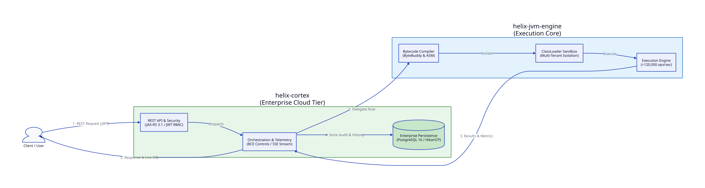
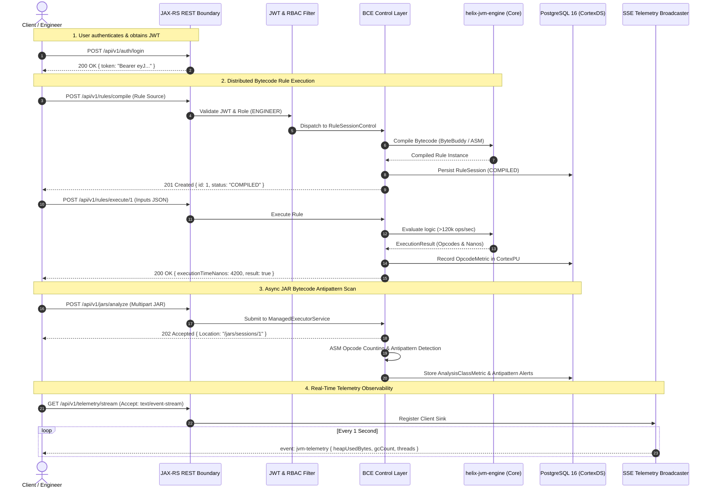

<div align="center">
  
  <h1>Helix Cortex — Enterprise Jakarta EE Platform</h1>
  <p><strong>A cloud-native supervisory API, asynchronous bytecode analyzer, and live JVM observability platform wrapping the Helix engine core.</strong></p>

  <p>
    <a href="https://github.com/7amo10/helix-cortex/actions"></a>
    <a href="https://jdk.java.net/17/"></a>
    <a href="https://jakarta.ee/specifications/platform/10/"></a>
    <a href="https://www.wildfly.org/"></a>
    <a href="https://www.postgresql.org/"></a>
    <a href="LICENSE"></a>
  </p>
</div>

---

## Executive Summary

`helix-cortex` (derived from "cerebral cortex" the intelligent supervisory outer layer) is an enterprise Jakarta EE 10 microservice that serves as the cloud-connected supervisory platform for the broader **Helix ecosystem**. While [helix-jvm-engine](https://github.com/7amo10/helix-jvm-engine) provides the raw execution core, classloader isolation, and low-level bytecode compilation (>120,000 ops/sec), **`helix-cortex` delivers the distributed enterprise supervisory tier as a connected service**.

By connecting to `helix-cortex`, developers and enterprise client applications can harness the power of Helix without embedding engine binaries or managing runtime classloaders directly:
- **Stateless Cloud Integration:** Exposes rule compilation, execution, and bytecode inspection via standard HTTP/REST with HMAC-SHA256 JWT bearer authentication.
- **Persistent Audit & Analytics:** Stores compiled rules, execution history, and nanosecond opcode metrics in PostgreSQL 16 using JPA 3.1 with zero N+1 queries.
- **Asynchronous Bytecode Inspection:** Disassembles uploaded JAR archives in background threads via `ManagedExecutorService` and detects bytecode antipatterns using OW2 ASM.
- **Live JVM Telemetry Streaming:** Broadcasts real-time HotSpot JVM memory layout, GC collector pauses, and thread states via Server-Sent Events (SSE).

---

## System Architecture & Connected Service Flow

The following diagram illustrates how clients interact with `helix-cortex` as a connected enterprise service wrapping `helix-jvm-engine`:

<div align="center">
  
</div>

### Client Interaction & Value Flow



### Key Benefits of the Connected Service Model

1. **Zero Client-Side Engine Overhead:** Downstream applications consume dynamic bytecode evaluation via standard REST APIs without needing JVM classloader permissions or ByteBuddy/ASM dependencies.
2. **Enterprise Persistence & History:** Complete audit trail of who compiled what, execution durations, and opcode footprints stored in PostgreSQL.
3. **Multi-Tenant ClassLoader Safety:** The underlying Helix engine encapsulates classloaders in isolated sandboxes, preventing metaspace leaks in the enterprise server.
4. **Decoupled Concurrency:** Heavy bytecode disassemblies and telemetry broadcasts run asynchronously via Jakarta Concurrency without blocking transactional worker threads.

---

## Technical Features & BCE Architecture

`helix-cortex` strictly follows Adam Bien's **Boundary-Control-Entity (BCE)** architectural pattern:

### 1. Boundary Layer (`com.pulse.boundary`)
- **REST Resources:** `AuthResource`, `RuleResource`, `JarAnalysisResource`, and `TelemetryResource` exposing 13 endpoints.
- **Security Interceptors:** Custom `@Secured` name-binding filter (`JwtSecurityFilter`) validating HMAC-SHA256 signatures and injecting `JwtSecurityContext`.
- **RFC 7807 Error Handling:** `GlobalExceptionMapper` translating business, validation, and optimistic locking errors into standard JSON Problem Details.

### 2. Control Layer (`com.pulse.control`)
- **`HelixProducer`:** CDI `@ApplicationScoped` factory producing and disposing thread-safe `RuleEngine` singletons.
- **`RuleSessionControl`:** Coordinates rule parsing, compilation, execution, and metric persistence.
- **`JarAnalysisControl` & ASM Visitor:** Asynchronously parses zip entries, tracks opcodes via `OpcodeCountingVisitor`, and dispatches CDI `@ObservesAsync` events.
- **`TelemetryControl`:** Polls `MemoryMXBean`, `GarbageCollectorMXBean`, and `ThreadMXBean`, broadcasting snapshots through `SseBroadcaster`.
- **Optimized Repositories:** `RuleSessionRepository` and `EngineerAccountRepository` using JPQL `LEFT JOIN FETCH` and Criteria API `EntityGraph` hints to ensure zero N+1 queries.

### 3. Entity Layer (`com.pulse.entity`)
- **Domain Model:** `EngineerAccount`, `RuleSession`, `OpcodeMetric`, `JarAnalysis`, `AnalysisClassMetric`, and `AuditLog`.
- **Optimistic Locking:** JPA `@Version` attributes protecting against concurrent overwrites.
- **Batching & Performance:** `@BatchSize(size = 20)` on class metrics and HikariCP connection pool tuned to 16 connections.

---

## Tech Stack

| Component | Technology | Version | Purpose |
|---|---|---|---|
| **Runtime Platform** | Jakarta EE | 10.0.0 | Enterprise API, CDI, JAX-RS, JPA, JTA, Concurrency |
| **Application Server** | WildFly | 31.0.0.Final | Certified Jakarta EE 10 application server container |
| **Java Runtime** | OpenJDK | 17 (LTS) | Base language platform |
| **Core Engine** | helix-jvm-engine | 1.0.0-SNAPSHOT | Core bytecode compilation and execution engine |
| **Database** | PostgreSQL | 16-alpine | Enterprise relational storage |
| **Connection Pool** | HikariCP | 5.1.0 | High-performance pooled datasource (CortexPool) |
| **Bytecode Analysis** | OW2 ASM | 9.6 | Class file inspection and opcode counter |
| **Security** | Jakarta Security / JJWT | 3.0 / 0.12.5 | PBKDF2 hashing & stateless JWT token validation |

---

## API Reference

The service exposes 13 REST API endpoints under `/api/v1`:

| Method | Path | Required Role | Description |
|---|---|---|---|
| `POST` | `/api/v1/auth/register` | Public | Register a new engineer or administrator account |
| `POST` | `/api/v1/auth/login` | Public | Authenticate credentials and receive an HMAC-SHA256 JWT bearer token |
| `POST` | `/api/v1/rules/compile` | `ENGINEER`, `ADMIN` | Compile rule source into bytecode and create an active `RuleSession` |
| `POST` | `/api/v1/rules/execute/{id}` | `ENGINEER`, `ADMIN` | Evaluate compiled rule with JSON context variables and record execution metrics |
| `GET` | `/api/v1/rules/sessions` | `ADMIN` | List all historical rule sessions across the platform |
| `GET` | `/api/v1/rules/sessions/mine` | `ENGINEER`, `ADMIN` | List rule sessions belonging to the caller |
| `GET` | `/api/v1/rules/sessions/{id}` | `ENGINEER`, `ADMIN` | Fetch session details including compiled bytecode opcode footprint |
| `GET` | `/api/v1/rules/sessions/high-density` | `ADMIN` | Filter sessions exceeding an opcode density threshold via Criteria API |
| `POST` | `/api/v1/jars/analyze` | `ENGINEER`, `ADMIN` | Asynchronously analyze uploaded JAR file for bytecode antipatterns |
| `GET` | `/api/v1/jars/sessions` | `ENGINEER`, `ADMIN` | List submitted JAR analysis jobs and their processing states |
| `GET` | `/api/v1/jars/sessions/{id}` | `ENGINEER`, `ADMIN` | Retrieve detailed per-class opcode metrics and antipattern diagnostics |
| `GET` | `/api/v1/telemetry/snapshot` | `ENGINEER`, `ADMIN` | Fetch instantaneous snapshot of JVM memory, GC pauses, and threads |
| `GET` | `/api/v1/telemetry/stream` | `ENGINEER`, `ADMIN` | Connect to live Server-Sent Events (SSE) stream broadcasting JVM metrics |

---

## Quick Start & Installation

### Requirements
- **JDK:** OpenJDK 17 or higher
- **Build Tool:** Apache Maven 3.8+
- **Container Engine:** Docker & Docker Compose

### 1. Build the Application
Clone the repository and package the WAR:

```bash
git clone https://github.com/7amo10/helix-cortex.git
cd helix-cortex
mvn clean package -DskipTests
```

### 2. Launch with Docker Compose
Configure environment secrets and start the stack:

```bash
cp .env.example .env
docker compose up --build
```

### 3. Verify Deployment
Once WildFly reports `deployed "helix-cortex.war"`, test the authentication endpoint:

```bash
curl -s -X POST http://localhost:8080/api/v1/auth/login \
  -H "Content-Type: application/json" \
  -d '{"username":"admin","password":"admin123"}'
```

---

## Automated Postman Test Suite

A complete Newman-compatible test collection covering all 13 endpoints and negative security constraints is available in `postman/helix-cortex.postman_collection.json`:

```bash
npx newman run postman/helix-cortex.postman_collection.json \
  --env-var "BASE_URL=http://localhost:8080/api/v1"
```

---

## Contributing

Contributions are welcome! Please read [CONTRIBUTING.md](CONTRIBUTING.md) for guidelines on code standards, branch naming, and pull request workflows.

---

## License

This project is licensed under the Apache License 2.0. See the [LICENSE](LICENSE) file for full details.
