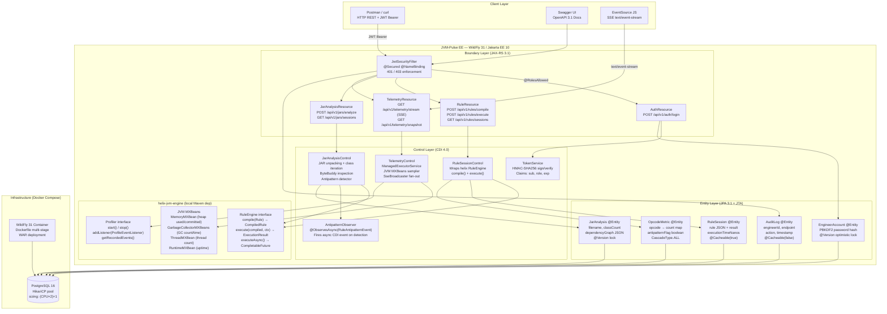

# JVM-Pulse EE — Capstone Project Implementation Plan

> **Project:** `jvm-pulse-ee` — Jakarta EE 10 REST Microservice backed by `helix-jvm-engine`  
> **Blueprint:** Week 4 (Days 22–28) of the Jakarta EE 10 Roadmap  
> **Status:** 🟡 Awaiting Approval

---

## Goal

Build **JVM-Pulse EE** — a production-grade Jakarta EE 10 REST microservice that wraps the `helix-jvm-engine` as a REST-accessible rule execution and JVM telemetry platform. Engineers submit JSON rules via REST, the engine compiles them to bytecode via ByteBuddy/ASM, results are persisted with JPA 3.1, live JVM metrics stream over SSE, and the entire system is fully JWT-secured with RBAC.

This is a **separate repository** (`jvm-pulse-ee`) that takes `helix-jvm-engine` as a local Maven dependency (`com.helix:engine-core:1.0.0-SNAPSHOT`). It is the enterprise service layer of the platform.

---

## Architecture Decisions (Based on Your Answers)

| Decision | Chosen |
|----------|--------|
| Jakarta EE Runtime | **WildFly 31** |
| Database | **PostgreSQL 16** (Docker Compose) |
| helix-jvm-engine integration | **Local Maven dependency** (`mvn install`) |
| Client Layer | **Postman Collection + OpenAPI/Swagger UI** |
| Containerization | **Single Dockerfile + Docker Compose** (one-command startup) |
| JWT Implementation | **Manual HMAC-SHA256** (`javax.crypto.Mac`) |
| Password Hashing | **PBKDF2WithHmacSHA256** (`Pbkdf2PasswordHash`) |
| RBAC Roles | **ENGINEER + ADMIN** (two-role model) |
| SSE Telemetry | **JVM MXBeans live** (heap, GC, threads — sampled every 1s) |
| Analysis Depth | **Advanced: full JAR analysis** + dependency graph + antipattern detection |
| Documentation | **Single comprehensive project README-style note** in MkDocs vault |

---

## Full System Architecture



---

## Project Structure

```
jvm-pulse-ee/
├── pom.xml                                  ← Jakarta EE 10 WAR, WildFly BOM
├── Dockerfile                               ← Multi-stage: build + WildFly runtime
├── docker-compose.yml                       ← app + postgres services
├── .env.example                             ← JWT_SECRET, DB credentials
├── README.md                                ← Portfolio README (architecture + API + demo)
├── postman/
│   └── JVM-Pulse-EE.postman_collection.json ← Complete API test collection
└── src/main/
    ├── java/com/pulse/
    │   ├── boundary/                         ← JAX-RS entry points
    │   │   ├── AuthResource.java
    │   │   ├── RuleResource.java
    │   │   ├── JarAnalysisResource.java
    │   │   ├── TelemetryResource.java
    │   │   └── filter/
    │   │       └── JwtSecurityFilter.java
    │   ├── control/                          ← CDI business logic
    │   │   ├── RuleSessionControl.java
    │   │   ├── JarAnalysisControl.java
    │   │   ├── TelemetryControl.java
    │   │   ├── TokenService.java
    │   │   └── AntipatternObserver.java
    │   ├── entity/                           ← JPA entities
    │   │   ├── EngineerAccount.java
    │   │   ├── RuleSession.java
    │   │   ├── OpcodeMetric.java
    │   │   ├── JarAnalysis.java
    │   │   └── AuditLog.java
    │   └── app/
    │       └── PulseApplication.java         ← @ApplicationPath("/api/v1")
    ├── resources/
    │   └── META-INF/
    │       ├── persistence.xml               ← PostgreSQL JTA DataSource + HikariCP
    │       └── microprofile-config.properties
    └── webapp/
        └── WEB-INF/
            └── web.xml                       ← Minimal, security constraints
```

---

## Component Breakdown

### 1. Boundary Layer

#### `AuthResource` — `POST /api/v1/auth/login`
No `@Secured` — public endpoint. Validates credentials against `EngineerAccount`, verifies PBKDF2 hash, returns signed JWT.

```java
@Path("/auth")
@Consumes(MediaType.APPLICATION_JSON)
@Produces(MediaType.APPLICATION_JSON)
public class AuthResource {

    @Inject EngineerAccountRepository repo;
    @Inject TokenService tokenService;

    @POST @Path("/login")
    public Response login(LoginRequest req) {
        EngineerAccount account = repo.findByUsername(req.username())
            .orElseThrow(() -> new WebApplicationException(401));

        if (!account.verifyPassword(req.password())) {
            throw new WebApplicationException(Response.status(401)
                .entity(new ErrorResponse("Invalid credentials")).build());
        }

        String token = tokenService.issue(account.getUsername(), account.getRole());
        return Response.ok(new LoginResponse(token, account.getRole(), 3600)).build();
    }
}
```

#### `RuleResource` — Rule Compilation & Execution
```java
@Path("/rules")
@Secured                              // ← @NameBinding — JwtSecurityFilter intercepts
@RolesAllowed({"ENGINEER", "ADMIN"})
public class RuleResource {

    @Inject RuleSessionControl control;

    @POST @Path("/compile")
    public Response compile(RuleRequest req) { ... }   // returns RuleSession with compiledId

    @POST @Path("/execute/{sessionId}")
    public Response execute(@PathParam("sessionId") Long id, ExecutionRequest req) { ... }

    @GET @Path("/sessions")
    @RolesAllowed("ADMIN")            // ← ADMIN only — all sessions
    public List<RuleSessionSummary> listAll() { ... }

    @GET @Path("/sessions/mine")      // ← ENGINEER — own sessions only
    public List<RuleSessionSummary> listMine(@Context SecurityContext sc) { ... }
}
```

#### `JarAnalysisResource` — Full JAR Analysis
```java
@Path("/jars")
@Secured
@RolesAllowed({"ENGINEER", "ADMIN"})
public class JarAnalysisResource {

    @Inject JarAnalysisControl control;

    @POST @Path("/analyze")
    @Consumes(MediaType.MULTIPART_FORM_DATA)
    public Response analyze(@FormDataParam("file") InputStream jarStream,
                            @FormDataParam("file") FormDataContentDisposition info) {
        // Async: offload to ManagedExecutorService, return 202 + Location header
        return Response.accepted()
            .header("Location", "/api/v1/jars/sessions/" + analysisId)
            .build();
    }

    @GET @Path("/sessions/{id}")
    public Response getAnalysis(@PathParam("id") Long id) { ... }
}
```

#### `TelemetryResource` — SSE Live JVM Metrics
```java
@Path("/telemetry")
@Secured
@RolesAllowed("ADMIN")
public class TelemetryResource {

    @Inject TelemetryControl control;
    @Context Sse sse;

    @GET @Path("/stream")
    @Produces(MediaType.SERVER_SENT_EVENTS)
    public void stream(@Context SseEventSink sink) {
        control.registerSink(sink);   // SseBroadcaster.register(sink)
    }

    @GET @Path("/snapshot")
    @Produces(MediaType.APPLICATION_JSON)
    public JvmTelemetrySnapshot snapshot() {
        return control.currentSnapshot();   // one-shot JMXBean read
    }
}
```

#### `JwtSecurityFilter` — `@Secured @NameBinding`
```java
@Secured                           // custom @NameBinding annotation
@Provider
@Priority(Priorities.AUTHENTICATION)
public class JwtSecurityFilter implements ContainerRequestFilter {

    @Inject TokenService tokenService;
    @Inject AuditLogRepository auditRepo;

    @Override
    public void filter(ContainerRequestContext ctx) {
        String auth = ctx.getHeaderString(HttpHeaders.AUTHORIZATION);

        if (auth == null || !auth.startsWith("Bearer ")) {
            ctx.abortWith(Response.status(401)
                .entity("{\"error\":\"Authorization header required\"}").build());
            return;
        }

        try {
            TokenClaims claims = tokenService.verify(auth.substring(7));
            ctx.setSecurityContext(new JwtSecurityContext(claims));

            // Write audit log asynchronously (non-blocking):
            auditRepo.logAsync(claims.subject(), ctx.getUriInfo().getPath());

        } catch (TokenExpiredException e) {
            ctx.abortWith(Response.status(401).entity("{\"error\":\"Token expired\"}").build());
        } catch (InvalidTokenException e) {
            ctx.abortWith(Response.status(403).entity("{\"error\":\"Invalid token\"}").build());
        }
    }
}
```

---

### 2. Control Layer

#### `RuleSessionControl` — helix `RuleEngine` Bridge
```java
@ApplicationScoped
@Transactional(TxType.MANDATORY)
public class RuleSessionControl {

    @PersistenceContext EntityManager em;
    @Inject RuleEngine ruleEngine;         // ← injected helix RuleEngine impl
    @Inject Event<RuleAntipatternEvent> antipatternEvent;

    public RuleSession compileAndSave(RuleRequest req, String engineerId) throws RuleCompilationException {
        Rule rule = JsonRuleAdapter.from(req);   // adapter from REST DTO → helix Rule
        CompiledRule compiled = ruleEngine.compile(rule);

        RuleSession session = new RuleSession(engineerId, req.ruleJson(), compiled.getId());
        em.persist(session);

        return session;
    }

    public ExecutionRecord executeAndSave(Long sessionId, Map<String, Object> variables) {
        RuleSession session = em.find(RuleSession.class, sessionId);
        CompiledRule compiled = ruleEngine.getCompiled(session.getCompiledRuleId());

        ExecutionContext ctx = new ExecutionContext(variables);
        ExecutionResult result = ruleEngine.execute(compiled, ctx);   // helix executes bytecode

        // Persist result + timing:
        ExecutionRecord record = new ExecutionRecord(session, result, result.getExecutionTimeNanos());
        em.persist(record);

        return record;
    }
}
```

#### `JarAnalysisControl` — Advanced JAR Inspection
```java
@ApplicationScoped
@Transactional(TxType.NOT_SUPPORTED)
public class JarAnalysisControl {

    @Resource ManagedExecutorService executor;
    @Inject Event<RuleAntipatternEvent> antipatternBus;
    @PersistenceContext EntityManager em;

    public CompletableFuture<JarAnalysis> analyzeAsync(InputStream jarStream, String filename) {
        return CompletableFuture.supplyAsync(() -> {
            try (JarInputStream jar = new JarInputStream(jarStream)) {
                List<ClassAnalysis> classes = new ArrayList<>();
                JarEntry entry;

                while ((entry = jar.getNextJarEntry()) != null) {
                    if (!entry.getName().endsWith(".class")) continue;

                    byte[] bytecode = jar.readAllBytes();
                    ClassAnalysis analysis = inspectClass(bytecode);   // uses ASM ClassReader
                    classes.add(analysis);

                    // Fire CDI async event if antipattern detected:
                    if (analysis.hasAntipattern()) {
                        antipatternBus.fireAsync(new RuleAntipatternEvent(analysis));
                    }
                }

                JarAnalysis jarAnalysis = new JarAnalysis(filename, classes);
                em.persist(jarAnalysis);
                return jarAnalysis;
            }
        }, executor);
    }

    private ClassAnalysis inspectClass(byte[] bytecode) {
        // ASM ClassReader — reads opcode distribution, method count, constant pool size:
        ClassReader reader = new ClassReader(bytecode);
        OpcodeVisitor visitor = new OpcodeVisitor(Opcodes.ASM9);
        reader.accept(visitor, ClassReader.SKIP_FRAMES);
        return visitor.buildAnalysis();
    }
}
```

#### `TelemetryControl` — JVM MXBeans + SSE Broadcaster
```java
@ApplicationScoped
public class TelemetryControl {

    @Context Sse sse;
    @Resource ManagedExecutorService executor;

    private SseBroadcaster broadcaster;
    private ScheduledFuture<?> samplerTask;

    // JMX references (JDK built-in, no helix dependency):
    private final MemoryMXBean memoryMX      = ManagementFactory.getMemoryMXBean();
    private final ThreadMXBean threadMX      = ManagementFactory.getThreadMXBean();
    private final RuntimeMXBean runtimeMX    = ManagementFactory.getRuntimeMXBean();
    private final List<GarbageCollectorMXBean> gcBeans = ManagementFactory.getGarbageCollectorMXBeans();

    @PostConstruct
    public void init() {
        broadcaster = sse.newBroadcaster();
        broadcaster.onClose(sink -> System.out.println("[TEL] Client disconnected"));

        // Start sampler — fires every 1 second on managed thread:
        samplerTask = executor.scheduleAtFixedRate(this::sampleAndBroadcast, 0, 1, TimeUnit.SECONDS);
    }

    public void registerSink(SseEventSink sink) {
        broadcaster.register(sink);
    }

    private void sampleAndBroadcast() {
        JvmTelemetrySnapshot snapshot = currentSnapshot();
        OutboundSseEvent event = sse.newEventBuilder()
            .name("jvm-telemetry")
            .id(String.valueOf(System.currentTimeMillis()))
            .data(JvmTelemetrySnapshot.class, snapshot)
            .build();
        broadcaster.broadcast(event);
    }

    public JvmTelemetrySnapshot currentSnapshot() {
        long gcCount = gcBeans.stream().mapToLong(GarbageCollectorMXBean::getCollectionCount).sum();
        long gcTime  = gcBeans.stream().mapToLong(GarbageCollectorMXBean::getCollectionTime).sum();

        return new JvmTelemetrySnapshot(
            memoryMX.getHeapMemoryUsage().getUsed(),
            memoryMX.getHeapMemoryUsage().getMax(),
            gcCount, gcTime,
            threadMX.getThreadCount(),
            runtimeMX.getUptime()
        );
    }
}
```

#### `TokenService` — Manual HMAC-SHA256 JWT
```java
@ApplicationScoped
public class TokenService {

    @Inject @ConfigProperty(name = "jwt.secret") String secret;
    private static final long EXPIRY_SECONDS = 3600;

    public String issue(String subject, String role) {
        // Header:
        String header = base64url("{\"alg\":\"HS256\",\"typ\":\"JWT\"}");

        // Payload:
        long exp = Instant.now().getEpochSecond() + EXPIRY_SECONDS;
        String payload = base64url("""
            {"sub":"%s","role":"%s","iat":%d,"exp":%d}
            """.formatted(subject, role, Instant.now().getEpochSecond(), exp));

        // Signature:
        String signature = hmacSha256(header + "." + payload, secret);
        return header + "." + payload + "." + signature;
    }

    public TokenClaims verify(String token) {
        String[] parts = token.split("\\.");
        if (parts.length != 3) throw new InvalidTokenException("Malformed JWT");

        // Verify signature:
        String expected = hmacSha256(parts[0] + "." + parts[1], secret);
        if (!MessageDigest.isEqual(expected.getBytes(), parts[2].getBytes()))
            throw new InvalidTokenException("Signature mismatch");

        // Decode claims:
        TokenClaims claims = parseClaims(parts[1]);
        if (claims.exp() < Instant.now().getEpochSecond())
            throw new TokenExpiredException("Token has expired");

        return claims;
    }

    private String hmacSha256(String data, String secret) {
        try {
            Mac mac = Mac.getInstance("HmacSHA256");
            mac.init(new SecretKeySpec(secret.getBytes(StandardCharsets.UTF_8), "HmacSHA256"));
            return base64url(mac.doFinal(data.getBytes(StandardCharsets.UTF_8)));
        } catch (Exception e) {
            throw new RuntimeException("JWT signing failed", e);
        }
    }
}
```

#### `AntipatternObserver` — `@ObservesAsync` CDI Event Handler
```java
@ApplicationScoped
public class AntipatternObserver {

    @Inject AuditLogRepository auditRepo;

    // Fired asynchronously when JarAnalysisControl detects a performance antipattern:
    public void onAntipattern(@ObservesAsync RuleAntipatternEvent event) {
        System.err.printf("[ALERT] Antipattern detected in class %s: %s%n",
            event.className(), event.antipatternType());

        // Could also: send SSE alert, write to AuditLog, trigger notification:
        auditRepo.writeAntipatternAlert(event);
    }
}
```

---

### 3. Entity Layer

#### `RuleSession` — JPA Entity (Persisted per compilation + execution)
```java
@Entity
@Table(name = "rule_session",
    indexes = @Index(name = "idx_rule_session_engineer", columnList = "engineer_id"))
@Cacheable(true)                       // Frequently read by ADMIN dashboard → L2 cache
public class RuleSession {

    @Id @GeneratedValue(strategy = GenerationType.IDENTITY)
    private Long id;

    @Column(name = "engineer_id", nullable = false)
    private String engineerId;

    @Column(name = "rule_json", columnDefinition = "TEXT", nullable = false)
    private String ruleJson;

    @Column(name = "compiled_rule_id", nullable = false)
    private String compiledRuleId;       // ID from helix CompiledRule

    @Enumerated(EnumType.STRING)
    private SessionStatus status;        // COMPILED | EXECUTED | FAILED

    @OneToMany(mappedBy = "session", cascade = CascadeType.ALL, orphanRemoval = true)
    @BatchSize(size = 10)               // N+1 prevention
    private List<OpcodeMetric> metrics = new ArrayList<>();

    @Version
    private Long version;               // Optimistic locking

    @Column(name = "created_at")
    private Instant createdAt = Instant.now();
}
```

#### `JarAnalysis` — Full JAR Analysis Result
```java
@Entity
@Table(name = "jar_analysis")
@Cacheable(false)    // Large analysis payloads — don't cache
public class JarAnalysis {

    @Id @GeneratedValue(strategy = GenerationType.IDENTITY)
    private Long id;

    @Column(nullable = false)
    private String filename;

    @Column(name = "class_count")
    private int classCount;

    @Column(name = "total_opcodes")
    private long totalOpcodes;

    @Column(name = "dependency_graph", columnDefinition = "TEXT")
    private String dependencyGraphJson;   // JSON-serialized class dependency graph

    @Column(name = "antipattern_count")
    private int antipatternCount;

    @OneToMany(mappedBy = "jarAnalysis", cascade = CascadeType.ALL)
    @BatchSize(size = 20)
    private List<OpcodeMetric> classMetrics = new ArrayList<>();

    @Version
    private Long version;
}
```

---

### 4. helix-jvm-engine Integration

#### Maven Dependency Setup
```bash
# Step 1: Install helix to local Maven repo:
cd /home/ahmedashour/Desktop/helix-jvm-engine
mvn install -DskipTests

# Step 2: Declare in jvm-pulse-ee pom.xml:
```

```xml
<dependency>
    <groupId>com.helix</groupId>
    <artifactId>engine-core</artifactId>
    <version>1.0.0-SNAPSHOT</version>
</dependency>
<dependency>
    <groupId>com.helix</groupId>
    <artifactId>engine-api</artifactId>
    <version>1.0.0-SNAPSHOT</version>
</dependency>
```

#### CDI Producer for `RuleEngine`
```java
@ApplicationScoped
public class HelixProducer {

    @Produces
    @ApplicationScoped
    public RuleEngine produceRuleEngine() {
        // Bootstrap helix RuleEngine — uses its internal HelixApplication factory:
        return HelixApplication.createEngine();
    }

    @Produces
    @ApplicationScoped
    public Profiler produceProfiler(RuleEngine engine) {
        return HelixApplication.createProfiler(engine);
    }
}
```

#### Helix API Usage Map

| helix Class | jvm-pulse-ee Usage |
|------------|-------------------|
| `RuleEngine.compile(Rule)` | `RuleSessionControl.compileAndSave()` |
| `RuleEngine.execute(CompiledRule, ExecutionContext)` | `RuleSessionControl.executeAndSave()` |
| `RuleEngine.executeAsync()` | JarAnalysisControl parallel class analysis |
| `ExecutionResult.getExecutionTimeNanos()` | Stored in `OpcodeMetric.executionTimeNanos` |
| `ExecutionContext.setVariable()` | Maps from REST `ExecutionRequest.variables` |
| `Profiler.addListener(ProfileEventListener)` | `TelemetryControl` subscribes, fans out via SSE |
| `ProfileEvent.timestamp()` | SSE event `id:` field |
| `MemoryAnalysisReport` | Optional: expose via `GET /api/v1/telemetry/memory/{class}` |

---

### 5. REST API Design

#### Full API Surface

| Method | Path | Auth | Role | Description |
|--------|------|------|------|-------------|
| `POST` | `/api/v1/auth/login` | None | Public | Issue JWT |
| `POST` | `/api/v1/auth/register` | None | Public | Register engineer |
| `POST` | `/api/v1/rules/compile` | JWT | ENGINEER + ADMIN | Compile JSON rule via helix |
| `POST` | `/api/v1/rules/execute/{id}` | JWT | ENGINEER + ADMIN | Execute compiled rule |
| `GET` | `/api/v1/rules/sessions` | JWT | ADMIN | All sessions (Criteria API) |
| `GET` | `/api/v1/rules/sessions/mine` | JWT | ENGINEER | Own sessions only |
| `GET` | `/api/v1/rules/sessions/high-density` | JWT | ADMIN | Criteria API: sessions with opcodes > threshold |
| `POST` | `/api/v1/jars/analyze` | JWT | ENGINEER + ADMIN | Upload JAR → async analysis |
| `GET` | `/api/v1/jars/sessions/{id}` | JWT | ENGINEER + ADMIN | Get analysis result |
| `GET` | `/api/v1/jars/sessions` | JWT | ADMIN | All JAR analyses |
| `GET` | `/api/v1/telemetry/stream` | JWT | ADMIN | SSE — live JVM MXBeans |
| `GET` | `/api/v1/telemetry/snapshot` | JWT | ADMIN | One-shot JVM metrics |
| `DELETE` | `/api/v1/admin/cache/flush` | JWT | ADMIN | Evict all L2 cache entries |

#### SSE Event Structure (1/second)
```
event: jvm-telemetry
id: 1726172483000
data: {
  "heapUsedBytes": 134217728,
  "heapMaxBytes": 536870912,
  "heapUsedPercent": 25.0,
  "gcCollectionCount": 14,
  "gcCollectionTimeMs": 87,
  "threadCount": 42,
  "uptimeMs": 153600
}

```

---

### 6. Persistence Configuration

#### `persistence.xml`
```xml
<persistence-unit name="pulsePU" transaction-type="JTA">
    <jta-data-source>java:jboss/datasources/PulseDS</jta-data-source>
    <shared-cache-mode>ENABLE_SELECTIVE</shared-cache-mode>
    <properties>
        <property name="jakarta.persistence.schema-generation.database.action" value="drop-and-create"/>
        <property name="jakarta.persistence.sql-load-script-source" value="META-INF/initial-data.sql"/>
        <property name="hibernate.show_sql" value="true"/>
        <property name="hibernate.format_sql" value="true"/>
        <property name="hibernate.generate_statistics" value="true"/>
        <property name="hibernate.default_batch_fetch_size" value="10"/>
        <property name="hibernate.hikari.maximumPoolSize" value="16"/>
        <property name="hibernate.hikari.connectionTimeout" value="3000"/>
        <property name="hibernate.hikari.maxLifetime" value="1800000"/>
    </properties>
</persistence-unit>
```

#### `initial-data.sql` — Seed Data
```sql
-- ADMIN account (password: "admin123" → PBKDF2 hash):
INSERT INTO engineer_account (username, password_hash, role) VALUES
  ('admin', '$pbkdf2-sha256$...', 'ADMIN');

-- ENGINEER account (password: "engineer123" → PBKDF2 hash):
INSERT INTO engineer_account (username, password_hash, role) VALUES
  ('engineer_1', '$pbkdf2-sha256$...', 'ENGINEER');
```

---

### 7. Docker Compose

```yaml
# docker-compose.yml
version: "3.9"
services:

  postgres:
    image: postgres:16-alpine
    environment:
      POSTGRES_DB: pulsedb
      POSTGRES_USER: pulse
      POSTGRES_PASSWORD: ${DB_PASSWORD}
    ports:
      - "5432:5432"
    volumes:
      - postgres-data:/var/lib/postgresql/data
    healthcheck:
      test: ["CMD-SHELL", "pg_isready -U pulse"]
      interval: 5s
      timeout: 3s
      retries: 10

  jvm-pulse-ee:
    build: .
    ports:
      - "8080:8080"
    environment:
      JWT_SECRET: ${JWT_SECRET}
      DB_URL: jdbc:postgresql://postgres:5432/pulsedb
      DB_USER: pulse
      DB_PASSWORD: ${DB_PASSWORD}
    depends_on:
      postgres:
        condition: service_healthy

volumes:
  postgres-data:
```

```dockerfile
# Dockerfile — multi-stage
FROM maven:3.9-eclipse-temurin-17 AS builder
WORKDIR /build
COPY pom.xml .
RUN mvn dependency:go-offline -q
COPY src ./src
RUN mvn package -DskipTests -q

FROM quay.io/wildfly/wildfly:31.0.0.Final-jdk17
COPY --from=builder /build/target/jvm-pulse-ee.war $JBOSS_HOME/standalone/deployments/
COPY docker/standalone.xml $JBOSS_HOME/standalone/configuration/
EXPOSE 8080
CMD ["/opt/jboss/wildfly/bin/standalone.sh", "-b", "0.0.0.0"]
```

---

### 8. JPA Criteria API — `findHighOpcodeDensitySessions()`

```java
// In RuleSessionRepository (called by ADMIN endpoint):
public List<RuleSession> findHighOpcodeDensitySessions(long threshold) {
    CriteriaBuilder cb = em.getCriteriaBuilder();
    CriteriaQuery<RuleSession> cq = cb.createQuery(RuleSession.class);
    Root<RuleSession> session = cq.from(RuleSession.class);
    Join<RuleSession, OpcodeMetric> metrics = session.join("metrics", JoinType.INNER);

    cq.select(session)
      .where(cb.gt(metrics.get("totalOpcodeCount"), threshold))
      .orderBy(cb.desc(metrics.get("totalOpcodeCount")));

    // EntityGraph to avoid N+1:
    EntityGraph<RuleSession> graph = em.createEntityGraph(RuleSession.class);
    graph.addAttributeNodes("metrics");

    return em.createQuery(cq)
             .setHint("jakarta.persistence.fetchgraph", graph)
             .getResultList();
}
```

---

## Build Timeline (7 Days)

| Day | Deliverable | Jakarta EE Concepts Applied |
|-----|------------|----------------------------|
| **22** | Repo setup, Maven + helix integration, BCE packages, JWT auth endpoints | JWT (Week 2), PBKDF2 (Week 2), BCE (Week 3) |
| **23** | Rule compile/execute REST endpoints, helix RuleEngine wiring, `RuleSession` JPA entity | JAX-RS (Week 1), JPA (Week 2), Optimistic Lock |
| **24** | JAR upload analysis endpoint, `JarAnalysis` entity, Criteria API high-density query | JPA Criteria API (Week 2), `@Version` (Week 2) |
| **25** | `ManagedExecutorService` async JAR analysis, `@ObservesAsync` antipattern events | Concurrency (Week 3), CDI Events (Week 1) |
| **26** | SSE `/telemetry/stream` with JVM MXBeans, `SseBroadcaster` fan-out | SSE (Week 3), `ManagedExecutorService` |
| **27** | HikariCP tuning, `JOIN FETCH` + `@BatchSize` + `EntityGraph` elimination of N+1, L2 cache | JPA Performance (Week 3), Pool Tuning (Week 3) |
| **28** | Dockerfile + Docker Compose, OpenAPI/Swagger UI, Postman collection, README portfolio | Deployment (Week 3), full integration test |

---

## Verification Plan

### Automated (per day)
```bash
# Day 22: Auth endpoints:
curl -X POST localhost:8080/api/v1/auth/login -d '{"username":"admin","password":"admin123"}' # → JWT
curl -H "Authorization: Bearer <token>" localhost:8080/api/v1/rules/sessions              # → 200
curl localhost:8080/api/v1/rules/sessions                                                   # → 401

# Day 25: Verify async analysis + antipattern detection:
curl -X POST localhost:8080/api/v1/jars/analyze -F file=@helix-core-1.0.0-SNAPSHOT.jar   # → 202
curl localhost:8080/api/v1/jars/sessions/1                                                  # → analysis JSON

# Day 26: SSE stream (open + receive events):
curl -N -H "Authorization: Bearer <adminToken>" localhost:8080/api/v1/telemetry/stream

# Day 27: Confirm N+1 elimination (check Hibernate statistics in logs):
# hibernate.generate_statistics=true → logs: "Statements: 1" for session list

# Day 28: Docker:
docker compose up --build        # one-command startup
curl localhost:8080/api/v1/auth/login  # → JWT from containerized stack
```

### Manual Verification
1. Postman collection: run all 14 endpoints with pre/post test scripts
2. Swagger UI at `localhost:8080/api/v1/openapi-ui/` shows all routes + schemas
3. SSE stream visible in browser `EventSource` console test
4. WildFly admin console confirms HikariCP pool at `localhost:9990`

---

## MkDocs Note (Single Page — Phase 3 Week 4)

After implementation, a **single comprehensive MkDocs note** will be added to:
```
docs/notes/phase-3/week-4-capstone-jvm-pulse-ee/index.md
```
Containing: architecture diagram, full API table, all key code patterns, helix integration map, Docker instructions, and portfolio talking points.

---

> [!IMPORTANT]
> **Approval needed:** Once you approve this plan, implementation begins on Day 22 (project setup, helix `mvn install`, skeleton repo, JWT auth). Each day's implementation will be verified before proceeding to the next.

> [!NOTE]
> **helix prerequisite step:** Before Day 22 coding begins, we must run `mvn install -DskipTests` in `/home/ahmedashour/Desktop/helix-jvm-engine` to install helix JARs into the local Maven repo (`~/.m2/repository/com/helix/`). The `jvm-pulse-ee` `pom.xml` will then depend on `com.helix:engine-core:1.0.0-SNAPSHOT` and `com.helix:engine-api:1.0.0-SNAPSHOT`.

> [!WARNING]
> **helix uses Java 17** (`maven.compiler.source=17`). The `jvm-pulse-ee` WAR will also target Java 17 to match. WildFly 31's Docker image uses `eclipse-temurin-17` — full compatibility.
